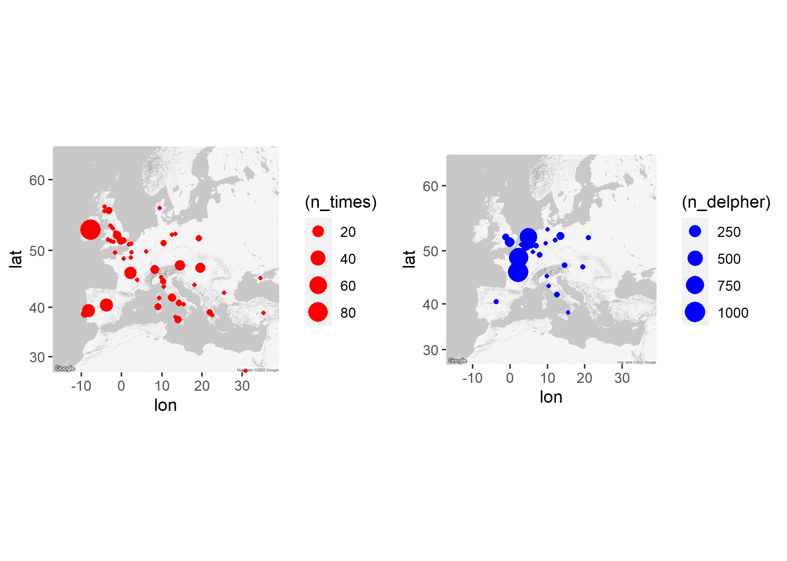

<center><b><h1>  Where were revolutions located between 1840 and 1860, based on article titles from Dutch and English newspapers?</b></center>


---------------------------------------------------------------------------------------------------------------------------
The Dutch dataset was constructed querying Delpher on the keyword 'revolutie' for the period 1840-1860, with OCR confidence between 80-100 per cent. Since Delpher has no bulk download option, we've instead used [I-Analyzer](https://ianalyzer.hum.uu.nl) (developed by the [DH Lab at Utrecht University](https://dig.hum.uu.nl/)). This tool allows to query and download Delpher search results for this period. If you want to construct the same dataset from Delpher, you can copy/paste [this URL](https://ianalyzer.hum.uu.nl/search/dutchnewspapers-public;query=revolutie;$date=1840-01-01:1860-12-31;$ocr=80:100;$category=artikel) into your browser

The same method has been used to fetch English articles from The Times, for the same period. Only addition is to exclude articles mentioning "industrial", since "industrial revolution" was also an often used term this period.

To plot the locations mentioned in the article titles several steps are needed: Named Entity Recognition, extracting the locations, geocoding these, and obtaining a map to plot them. Here we've used (mainly) R for this, but Python would work as well. 

Apart from having R installed, you'll also need a python executable with [spaCy](https://spacy.io/usage) installed, and the corresponding [Dutch language model](https://spacy.io/models/nl#nl_core_news_sm). If you opt for a Google Map you'll also need a [Google API key for its Maps platform](https://developers.google.com/maps/faq). This is free as long as you don't exceed $200 in API calls a month (which usually does't happen).

First we load the required libraries and the Delpher dataset.

```{r message=FALSE, warning=FALSE, echo=TRUE}

library(data.table)
library(spacyr)
library(maps)
library(rasterVis)
library(raster)
library(ggmap)
library(ggplot2)
library(ggpubr)
library(ggpubr)

revol <- fread("C:\\Users\\Schal107\\Documents\\UBU\\Team DH\\Delpher\\dutchnewspapers-public_query=revolutie_date=1840-01-01 1860-12-31_ocr=80 100_sort=date,desc.csv")
setDT(revol)

```

Let's keep only the variables we want to continue to work with. And inspect the first rows of this subset. You'll already notice the mentioning of "FRANKRIJK" (France) and "WEENEN" (Vienna) here.

```{r message=FALSE, warning=FALSE, echo=TRUE}
x <- revol[,c("date", "article_title", "url")]
x[5851:5858]


```
Not required for now, but below demonstrates how to extract years from the date variable.

```{r message=FALSE, warning=FALSE, echo=TRUE}
x$date <- as.Date(x$date)
x[, year := as.numeric(substr(x$date, 1,4))]
setDT(x)
x[, .N, list(year)][order(-year)][1:10]


```

For better Named Entity Recognition we will change the article_title variable to lower case strings. SpaCy has the tendency to recognize uppercase strings as corporations.

```{r message=FALSE, warning=FALSE, echo=TRUE}
x$article_title <- tolower(x$article_title)
```

Now we need to call in action the [Dutch language model](https://spacy.io/models/nl/#nl_core_news_sm) from spaCy to perform NER. If you want to replicate this analysis, you need to have this installed on your local machine. Read the website for installation instructions. 

```{r message=FALSE, warning=FALSE, echo=TRUE}
spacy_initialize(model = "nl_core_news_sm")
```

Below we parse the article_title to SpaCy and perform NER. You'll see that it has recognized at least some locations.

```{r message=FALSE, warning=FALSE, echo=TRUE}
parsedtxt <- spacy_parse(x$article_title, lemma = FALSE, entity = TRUE, nounphrase = TRUE)

locations <- entity_extract(parsedtxt)

setDT(locations)
top100 <- locations[entity_type == "GPE", .N, list(entity) ][order(-N)]

head(top100)
```

Before we can plot them on a map, we need to add coordinates to the placenames. We'll use the Google Maps API for that. Notice that you will need your own key to do so. You can register for a free API key at Google.

```{r message=FALSE, warning=FALSE, echo=TRUE}
google_key <- fread("C:\\Users\\Schal107\\Documents\\UBU\\Team DH\\Delpher\\google_key.txt")
register_google(key = paste0(google_key$key))

coordinates <- geocode(top100$entity)

head(coordinates)
```

After the geocoding we merge the retrieved coordinates with the placenames.

```{r message=FALSE, warning=FALSE, echo=TRUE}
coordinates_delpher <- cbind(top100, coordinates)
head(coordinates_delpher)
```

<center><b><h1>  Now we'll do the same for articles from The Times</b></center>

You can reconstruct the Times dataset using [this I-analyzer URL](https://ianalyzer.hum.uu.nl/search/times;query=revolution%20-%20industrial;$date=1840-01-01:1860-12-31;$ocr=80:100)

```{r message=FALSE, warning=FALSE, echo=TRUE}
times <- fread("C:\\Users\\Schal107\\Documents\\UBU\\Team DH\\Delpher\\times_query=revolution_-_industrial_date=1840-01-01 1860-12-31_ocr=80 100.csv")
colnames(times)
```

Now we'll perform Named Entity Recognition and geocoding on the English titles.

```{r message=FALSE, warning=FALSE, echo=TRUE}
spacy_initialize(model = "en_core_web_sm")
parsedtxt2 <- spacy_parse(times$title, lemma = FALSE, entity = TRUE, nounphrase = TRUE)
locations2 <- entity_extract(parsedtxt2)

setDT(locations2)
times_locations <- locations2[entity_type == "GPE", .N, list(entity) ][order(-N)]
head(times_locations)

coordinates_times <- geocode(times_locations$entity)
coordinates_times <- cbind(times_locations, coordinates_times)
head(coordinates_times)
```

We now merge the two datasets. To identify the two datasets after merging, we add a 'dataset 'variable and rename "N".

```{r message=FALSE, warning=FALSE, echo=TRUE}
coordinates_times[, dataset := "times",]
coordinates_delpher[, dataset := "delpher"]
setnames(coordinates_times, "N", "n_times")
setnames(coordinates_delpher, "N", "n_delpher")

setnames(coordinates_times, "entity", "entity_times")
setnames(coordinates_delpher, "entity", "entity_delpher")

coordinates_times <- coordinates_times[!is.na(lon),]
coordinates_delpher <- coordinates_delpher[!is.na(lon),]
```

<center><b><h1>  Final: plot coordinates from Delpher and Times on a map</b></center>

Now we'll need a map! You can use the standard Google Map and define a centre using latitute and longitude. However, for historical data I like to remove roads and names from the map. You can do that by making your own map at [Google Mapstyle](https://mapstyle.withgoogle.com/). With the same API key as you've use for the geocoding, you can export the URL of your map of choice, and paste it below in the function `get_googlemap`. For some reason, though, you first need to extract the lat and long from this URL, and the zoom level (see below). Then you paste the remaining URL from the first mention of '&maptype' behind `path =` (don't forget to include it in quotes). Then it should work!

```{r message=FALSE, warning=FALSE, echo=TRUE}
europe5 <- get_googlemap(center=c(lon=10.95931966568949, lat=48.561877580811775), zoom = 4, path = "&maptype=roadmap&style=element:geometry%7Ccolor:0xf5f5f5&style=element:labels%7Cvisibility:off&style=element:labels.icon%7Cvisibility:off&style=element:labels.text.fill%7Ccolor:0x616161&style=element:labels.text.stroke%7Ccolor:0xf5f5f5&style=feature:administrative.land_parcel%7Cvisibility:off&style=feature:administrative.land_parcel%7Celement:labels.text.fill%7Ccolor:0xbdbdbd&style=feature:administrative.neighborhood%7Cvisibility:off&style=feature:landscape.natural.terrain%7Ccolor:0xffffff%7Cvisibility:on%7Cweight:4&style=feature:landscape.natural.terrain%7Celement:geometry.fill%7Cvisibility:on%7Cweight:4&style=feature:landscape.natural.terrain%7Celement:geometry.stroke%7Cvisibility:on&style=feature:poi%7Celement:geometry%7Ccolor:0xeeeeee&style=feature:poi%7Celement:labels.text.fill%7Ccolor:0x757575&style=feature:poi.park%7Celement:geometry%7Ccolor:0xe5e5e5&style=feature:poi.park%7Celement:labels.text.fill%7Ccolor:0x9e9e9e&style=feature:road%7Cvisibility:off&style=feature:road%7Celement:geometry%7Ccolor:0xffffff&style=feature:road.arterial%7Celement:labels.text.fill%7Ccolor:0x757575&style=feature:road.highway%7Celement:geometry%7Ccolor:0xdadada&style=feature:road.highway%7Celement:labels.text.fill%7Ccolor:0x616161&style=feature:road.local%7Celement:labels.text.fill%7Ccolor:0x9e9e9e&style=feature:transit.line%7Celement:geometry%7Ccolor:0xe5e5e5&style=feature:transit.station%7Celement:geometry%7Ccolor:0xeeeeee&style=feature:water%7Celement:geometry%7Ccolor:0xc9c9c9&style=feature:water%7Celement:labels.text.fill%7Ccolor:0x9e9e9e&size=480x360")

```

Now that we have our map loaded, we parse it to ggmap. Then we can add our data to it. The size of the dots corresponds to the number of times the geocoded placename is mentioned in our article titles. You'll see that Paris and France are dominant, but also that we spot some unexpected places in Italy and even Eastern Europe.

```{r message=FALSE, warning=FALSE, echo=TRUE}
p <- ggmap(europe5)
times <- p + geom_point(data = coordinates_times, aes(x=lon, y=lat, size=(n_times)), shape=16, color = "red")
invisible(ggplot_build(times))
ggsave("times_map.png")

p <- ggmap(europe5)
delpher <- p + geom_point(data = coordinates_delpher, aes(x=lon, y=lat, size=(n_delpher)), shape=16, color = "blue")
invisible(ggplot_build(delpher))
ggsave("delpher_map.png")

invisible(ggarrange(times, delpher))
ggsave("all_map.png")
```

<center><b><h3>  And here we have our results:</b></center>

[](all_map.png)


